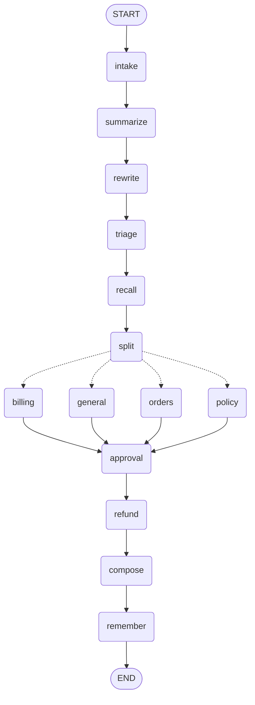

# The v8 inbox graph

Generated by `uv run python -m workflows.inbox.graph`. Do not edit by hand.

```mermaid
graph TD
    graph_start([START])
    intake(intake)
    summarize(summarize)
    rewrite(rewrite)
    triage(triage)
    recall(recall)
    split(split)
    orders(orders)
    billing(billing)
    policy(policy)
    general(general)
    approval(approval)
    refund(refund)
    compose(compose)
    remember(remember)
    graph_end([END])
    graph_start --> intake
    approval --> refund
    billing --> approval
    compose --> remember
    general --> approval
    intake --> summarize
    orders --> approval
    policy --> approval
    recall --> split
    refund --> compose
    rewrite --> triage
    split -.-> billing
    split -.-> general
    split -.-> orders
    split -.-> policy
    summarize --> rewrite
    triage --> recall
    remember --> graph_end
```
