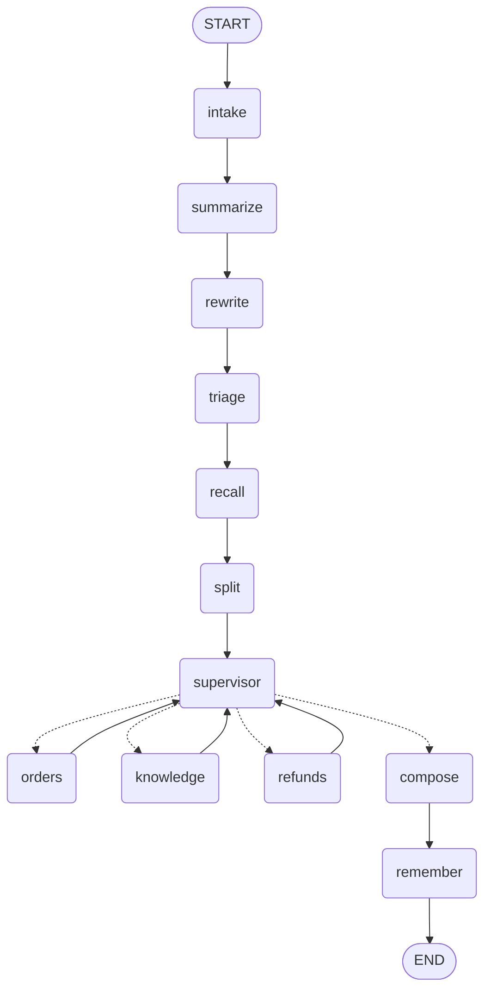

# The v9 supervisor graph

Generated by `uv run python -m workflows.supervisor.graph`. Do not edit by hand.

```mermaid
graph TD
    graph_start([START])
    intake(intake)
    summarize(summarize)
    rewrite(rewrite)
    triage(triage)
    recall(recall)
    split(split)
    supervisor(supervisor)
    orders(orders)
    knowledge(knowledge)
    refunds(refunds)
    compose(compose)
    remember(remember)
    graph_end([END])
    graph_start --> intake
    compose --> remember
    intake --> summarize
    knowledge --> supervisor
    orders --> supervisor
    recall --> split
    refunds --> supervisor
    rewrite --> triage
    split --> supervisor
    summarize --> rewrite
    supervisor -.-> compose
    supervisor -.-> knowledge
    supervisor -.-> orders
    supervisor -.-> refunds
    triage --> recall
    remember --> graph_end
```
